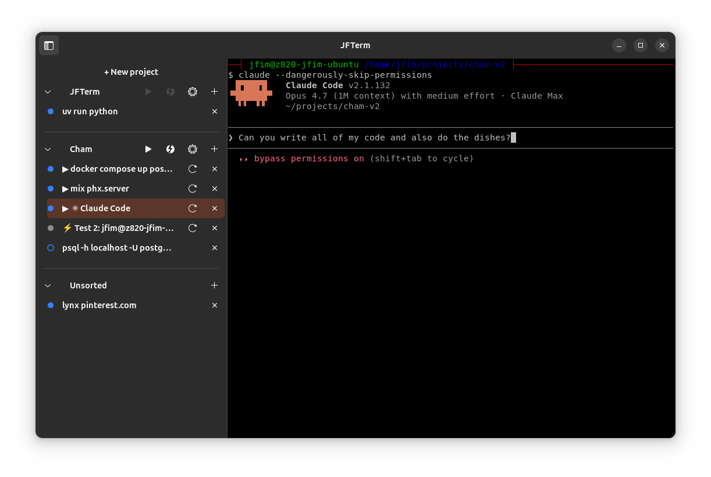
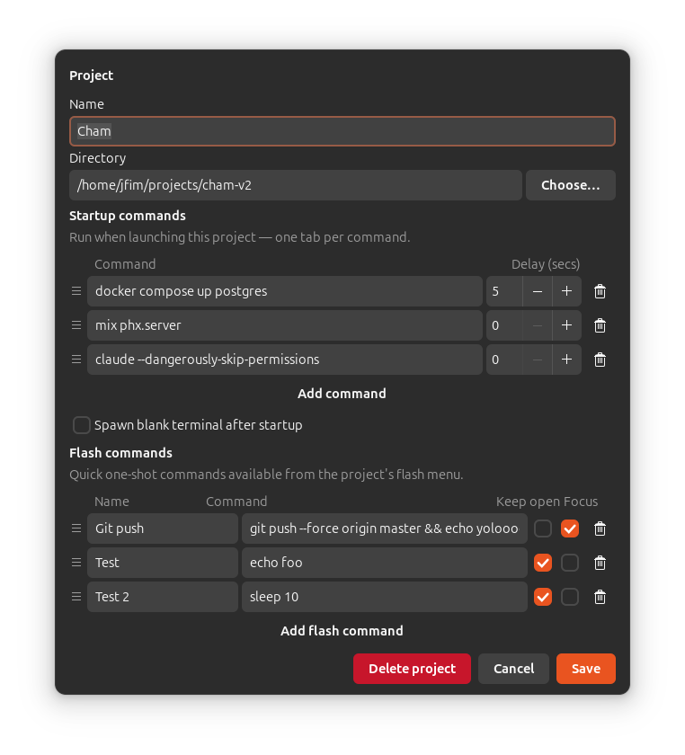

# JFTerm

A terminal for people juggling multiple projects — per-project tab groups and
one-click access to each project's setup.

## Features

- Per-project tab groups in a sidebar, plus an Unsorted bucket for ad-hoc tabs.
- One-click launch of a project's configured startup commands, with
  per-command delays, drag-and-drop reordering, and skipping of commands
  already running in the project.
- Flash commands: a per-project menu of one-off commands you can fire into
  a new tab from the sidebar.
- Restart button on tabs spawned from a startup command — kills the shell
  and re-runs the original command in place.
- Status dot per tab showing whether the shell is busy and whether the cwd
  matches the tab's project.
- Drag-and-drop to move tabs between projects.
- Built on GTK 4 / libadwaita with VTE 3.91 for the terminal itself.

## Running

Requires Python 3.12+ and `uv`, plus the GTK 4 / libadwaita / VTE 3.91 system
libraries. On Ubuntu 24.04:

    sudo apt install \
        gir1.2-gtk-4.0 gir1.2-adw-1 gir1.2-vte-3.91 \
        libvte-2.91-gtk4-0 \
        python3-gi python3-cairo

The project relies on the apt-installed PyGObject + VTE bindings (building
`pygobject` from source needs `libgirepository-2.0-dev` and is slow). The
venv must be created with `--system-site-packages` so it can import the
system `gi`. **Run this once before the first `uv run`** — a plain `uv sync`
auto-creates a venv *without* that flag, which then fails with
`ModuleNotFoundError: No module named 'gi'`:

    uv venv --system-site-packages --python /usr/bin/python3
    uv sync

Then:

    uv run python -m jfterm

If you delete `.venv`, repeat the `uv venv …` step before `uv sync`.

For the prompt-running indicator (blue dot) to be most accurate, configure your
shell to emit OSC 7 (cwd) and OSC 133 (prompt/command markers). The design doc
has a bash snippet that does this. Without OSC 133 the indicator falls back to
polling `tcgetpgrp` every 250 ms, which still works but with slightly higher
latency.

## Status dot

Each tab row has a status dot with two visual axes:

**Color — running state:**
- **Blue:** a foreground subprocess is running in the tab's shell.
- **Grey:** the shell is at its prompt.

**Fill — in-place state** (*filled = tab is in the right home; outline = the tab could be moved*; clicking the dot opens a "Move To" menu):
- Tab in a **project:** filled if the cwd is inside the project's directory, outline otherwise.
- Tab in **Unsorted:** filled if the cwd matches no project, outline if it's inside some project's directory.

## Development

    uv run pytest -v

Pure-logic modules (models, persistence, matching) are covered by tests.
GUI behavior is verified manually.
